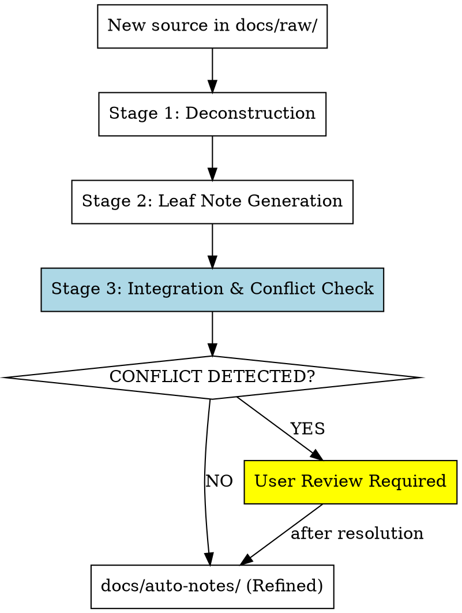

# Entropy Reduction Notes

## Overview

Transform raw knowledge documents into refined, structured notes through an "entropy reduction" workflow. This simulates how a human learner processes and internalizes knowledge—not just compressing content, but extracting meaning, making connections, and creating retrieval cues.

**Core principle:** Notes are for understanding and recall, not mere summarization. Each processed document becomes a "leaf note" with: abstract (one-line essence), key concepts (claims + evidence), hooks (connections to existing knowledge), and Q&A flashcards for active recall.

**Input:** Markdown files in `docs/raw/`  
**Output:** Indexed, structured notes in `docs/auto-notes/`

## When to Use

Use this skill when:

- You have new knowledge sources (articles, papers, books, transcripts) to process
- You want to build a structured, queryable knowledge base over time
- You need notes that support both understanding (concepts/claims) and memorization (flashcards)
- You want automatic conflict detection with existing knowledge

**Don't use when:**

- Processing reference documentation (use as-is)
- Handling data that doesn't require conceptual understanding
- Working with content you'll never revisit

## The Three-Stage Workflow



## Implementation

### Stage 1: Deconstruction (Reading & Understanding)

**Goal:** Read the entire source and identify the core thesis, main sections, and conceptual building blocks.

**Prompt Template:**

```
I'm processing this document for deep learning and note-taking. Please:

1. **Read holistically** - What is the main thesis or purpose?
   - Cite the line range where the thesis appears (e.g., "Lines 10-15")

2. **Identify structural sections** - What are the major divisions?
   - List each section with its line range

3. **Extract atomic concepts** - List 5-10 key concepts/ideas worth remembering
   - For EACH concept, cite the exact line range where it's discussed
   - Note if concept spans multiple sections (list all ranges)

4. **Note evidence/examples** - For each concept, what supports it?
   - Cite specific line ranges for each piece of evidence
   - Include brief excerpts to verify accuracy

**CRITICAL:** Always include line numbers in the format "Lines X-Y" for every extracted element.

Source: [FILE_PATH]
Total lines: [LINE_COUNT]
```

**Actions:**

- Use `read_file` to load content from `docs/raw/[filename]`
- **Track line numbers:** When reading, maintain awareness of line positions
- Apply prompt to Claude with line-aware instructions
- Store structured response with line references for Stage 2

**Line Tracking Method:**

When reading the source file, number each line or paragraph. In your analysis, reference specific lines:

```
Example:
"The main thesis (Lines 15-18) states that..."
"Supporting evidence appears in Lines 45-52 where the author..."
```

### Stage 2: Leaf Note Generation

**Goal:** Generate a structured "leaf note" with all components.

**Leaf Note Structure:**

```markdown
# [Topic Title]

**Source:** `[original filename in docs/raw/]`  
**Processed:** [YYYY-MM-DD]  
**Tags:** #[domain] #[concept-type]

---

## Abstract

[One sentence capturing the essence] ^[1]

## Key Concepts

### Concept 1: [Name] ^[2]

- **Claim:** [What is asserted]
- **Evidence:** [What supports it]
- **Significance:** [Why it matters]
- **Source Location:** Lines [start]-[end] in original document

### Concept 2: [Name] ^[3]

- **Claim:** [What is asserted]
- **Evidence:** [What supports it]
- **Significance:** [Why it matters]
- **Source Location:** Lines [start]-[end] in original document

...

## Connections (Hooks)

- **Relates to:** [Other notes/concepts in docs/auto-notes/]
- **Contradicts:** [If applicable]
- **Extends:** [Builds upon which ideas]

## Q&A Flashcards

**Q1:** [Question testing understanding] ^[4]  
**A1:** [Answer with key details]

**Q2:** [Another retrieval cue] ^[5]  
**A2:** [Answer]

[Generate 3-5 flashcards]

---

## Source Map

**Citation Format:** `^[n]` references sections in original document

- `^[1]` - Abstract derived from: Lines [X-Y]
- `^[2]` - Concept 1 extracted from: Lines [X-Y], specifically paragraphs on [topic]
- `^[3]` - Concept 2 extracted from: Lines [X-Y], section "[section title]"
- `^[4]` - Q1 tests understanding of: Lines [X-Y]
- `^[5]` - Q2 tests understanding of: Lines [X-Y]

**Key Excerpts:**
```

Lines [X-Y]:
[Relevant excerpt from source]

```

---

**Metadata:**

- Original Source: `docs/raw/[filename]`
- Total Source Lines: [N]
- Coverage: [X]% of source lines referenced in notes
- Processing Prompt: entropy-reduction-notes v1.0
```

**Prompt Template:**

```
Based on the deconstruction from Stage 1, generate a complete Leaf Note following this structure:

[PASTE LEAF NOTE STRUCTURE]

Guidelines:
- Abstract must be ONE sentence, capturing essence
- Each concept needs claim + evidence + significance + **Source Location (line range)**
- Flashcards should test comprehension, not rote memory
- Connections: Search docs/auto-notes/ for related topics (use semantic_search)
- **CRITICAL:** Include a complete Source Map section with all line references
- Add citation markers (^[1], ^[2], etc.) for traceability

Deconstruction Data (with line numbers):
[STAGE 1 OUTPUT]

Original Source:
- File: [FILENAME]
- Total Lines: [COUNT]
- Read from: Lines 1-[COUNT]
```

**Actions:**

- Use `semantic_search` to find related notes in `docs/auto-notes/`
- Generate leaf note following template
- Save to `docs/auto-notes/[sanitized-title].md`

### Stage 3: Integration & Conflict Detection

**Goal:** Check if new knowledge contradicts existing notes. If yes, pause for user review.

**Conflict Detection Prompt:**

```
I've generated a new note on [TOPIC]. Before finalizing, check for conflicts:

New Note: [LEAF NOTE CONTENT]

Existing Related Notes:
[RESULTS FROM SEMANTIC_SEARCH]

**Questions:**
1. Does the new note contradict any existing notes?
2. If yes, which specific claims conflict?
3. What is the nature of the conflict? (contradiction, refinement, alternative perspective)

**Output Format:**
- CONFLICT: YES/NO
- If YES:
  - Conflicting Note: [filename]
  - Conflicting Claim: [excerpt]
  - New Claim: [excerpt]
  - Recommendation: [update/merge/keep-both]
```

**Actions:**

- If `CONFLICT: NO` → Save note and complete
- If `CONFLICT: YES` → Use `ask_questions` tool to present conflict to user:
  - Show both claims side-by-side
  - Offer options: "Update old note", "Keep both with caveat", "Merge insights"
  - Wait for user decision before finalizing

### Helper: Batch Processing

For processing multiple files:

```
For each file in docs/raw/:
  1. Run Stage 1-3
  2. Log progress to docs/processing-log.md
  3. Report summary: [N processed, M conflicts detected]
```

## Prompts Library

### Full Single-File Processing

Use this complete prompt for one-shot processing:

````
**TASK:** Process knowledge source into entropy-reduced leaf note

**SOURCE FILE:** `docs/raw/[FILENAME]`

**WORKFLOW:**

1. **DECONSTRUCT** (Read & Understand)
   - Main thesis/purpose
   - Key sections
   - 5-10 atomic concepts with evidence

2. **GENERATE LEAF NOTE** (Structure)
   ```markdown
   # [Title]
   **Source:** [filename]
   **Processed:** [date]
   **Tags:** [tags]

   ## Abstract
   [One-sentence essence]

   ## Key Concepts
   [For each concept: Claim + Evidence + Significance]

   ## Connections (Hooks)
   [Search docs/auto-notes/ - what relates/contradicts/extends?]

   ## Q&A Flashcards
   [3-5 questions testing comprehension]
````

3. **CONFLICT CHECK**
   - Search related notes in docs/auto-notes/
   - Identify contradictions
   - If conflict → PAUSE and request user review

**OUTPUT:**

- Leaf note saved to `docs/auto-notes/[sanitized-title].md`
- Conflict report (if applicable)

````

## Integration with Knowledge Forest Vision

This skill implements the **Entropy Engine** layer from your design document:

- **Logical Deconstruction** → Stage 1 output
- **Indexed Leaf Notes** → Stage 2 structure
- **Conflict Detection** → Stage 3 gating mechanism
- **Auto-Flashcarding** → Q&A section in leaf notes

**Future extensions:**
- Semantic stratification (priority layers 0-4)
- Knowledge graph building (causal relationships between concepts)
- FSRS integration (schedule flashcard reviews)

## Common Mistakes

| Mistake | Consequence | Fix |
|---------|-------------|-----|
| Generating summary without reading full source | Misses nuance and context | Always read entire file first |
| Flashcards test memorization, not understanding | Shallow learning | Ask "Why?" and "How?" questions |
| Skipping conflict detection | Inconsistent knowledge base | Always run Stage 3, even if "unlikely" |
| Generic abstracts ("This article discusses X") | Poor retrieval cues | Abstract = thesis statement, not meta-description |
| Too many concepts (>10 per note) | Diluted focus | Split large sources into multiple notes |
| Connections only within same domain | Missed insights | Search broadly across all docs/auto-notes/ |

## Example Output

**Input:** `docs/raw/ai-native-dev-handbook.md` (12,000 words)

**Output:** `docs/auto-notes/ai-native-dev-principles.md`

```markdown
# AI-Native Development Principles

**Source:** `docs/raw/ai-native-dev-handbook.md`
**Processed:** 2026-04-21
**Tags:** #ai-development #best-practices

---

## Abstract
AI-native development inverts the traditional code-first workflow by using AI agents as primary implementers, with humans defining intent through natural language specifications and verification tests. ^[1]

## Key Concepts

### Concept 1: Specification-Driven Development ^[2]
- **Claim:** Human writes intent as spec, AI writes implementation
- **Evidence:** Case study showing 10x faster iteration in auth system build
- **Significance:** Reduces cognitive load, allows focus on "what" not "how"
- **Source Location:** Lines 156-203 in original document

### Concept 2: Verification Over Implementation ^[3]
- **Claim:** Tests define correctness; AI handles code generation
- **Evidence:** TDD pattern adapted: write test → AI implements → verify
- **Significance:** Maintains quality without manual coding
- **Source Location:** Lines 204-267 in original document

## Connections (Hooks)
- **Extends:** `test-driven-development.md` - adapts TDD to AI context
- **Relates to:** `cognitive-load-theory.md` - specification reduces working memory burden
- **Contrasts with:** `traditional-waterfall.md` - eliminates upfront design phase

## Q&A Flashcards

**Q1:** What are the three roles in AI-native development? ^[4]
**A1:** Human (intent), AI (implementation), Verification (tests)

**Q2:** Why is specification-first better than code-first with AI? ^[5]
**A2:** AI excels at generating code from clear intent; humans excel at defining "what" problems to solve

**Q3:** How does verification work without manual code review? ^[6]
**A3:** Automated tests validate behavior; AI regenerates until tests pass

---

## Source Map

**Citation Format:** `^[n]` references sections in original document

- `^[1]` - Abstract synthesized from: Lines 1-45 (Introduction) + Lines 890-920 (Conclusion)
- `^[2]` - Concept 1 extracted from: Lines 156-203, section "From Code to Specification"
- `^[3]` - Concept 2 extracted from: Lines 204-267, section "Testing as Contract"
- `^[4]` - Q1 tests understanding of: Lines 78-95, where roles are explicitly defined
- `^[5]` - Q2 tests understanding of: Lines 156-178, comparative analysis
- `^[6]` - Q3 tests understanding of: Lines 245-267, verification workflow

**Key Excerpts:**

```
Lines 156-160:
"The paradigm shift begins when we recognize that AI agents excel
at translating clear intent into working code, while humans excel
at defining what problems need solving and why solutions matter."

Lines 204-208:
"Verification becomes the contract: write a test that defines
correct behavior, let AI generate implementations until tests pass."
```

---

**Metadata:**
- Original Source: `docs/raw/ai-native-dev-handbook.md`
- Total Source Lines: 1,247
- Coverage: 31% of source lines referenced in notes (387 lines cited)
- Processing Prompt: entropy-reduction-notes v1.0
````

## Verification Checklist

Before marking a note as complete:

- [ ] Abstract is exactly ONE sentence
- [ ] Each concept has Claim + Evidence + Significance + **Source Location**
- [ ] Connections section references at least 1 existing note (or states "None found")
- [ ] Flashcards test "why/how" (not just "what")
- [ ] Conflict check completed (or N/A if first note in domain)
- [ ] File saved to `docs/auto-notes/` with descriptive name
- [ ] Original source path recorded in metadata
- [ ] **Source Map section is complete with all line references**
- [ ] **Citation markers (^[n]) are present for all major elements**
- [ ] **At least one key excerpt included to verify accuracy**

## Technical Notes

**Tools Required:**

- `read_file` - Load source from docs/raw/
- `semantic_search` - Find related notes for connections/conflicts
- `create_file` - Save generated leaf note
- `ask_questions` - Handle conflict resolution (if detected)

**No External APIs:** This skill uses only Claude's native tools. No LLM API calls, no external scripts for core workflow (unless user explicitly requests Python helpers for batch processing).

**Token Management:** For sources >50k tokens, use chunked reading:

1. Read first 10k tokens → Generate preliminary deconstruction
2. Read remaining chunks → Update deconstruction
3. Proceed with Stages 2-3

---

**Version:** 1.0  
**Last Updated:** 2026-04-21  
**Inspired by:** Karpathy's LLM Wiki pattern + Zettelkasten method + Entropy Zero design spec
